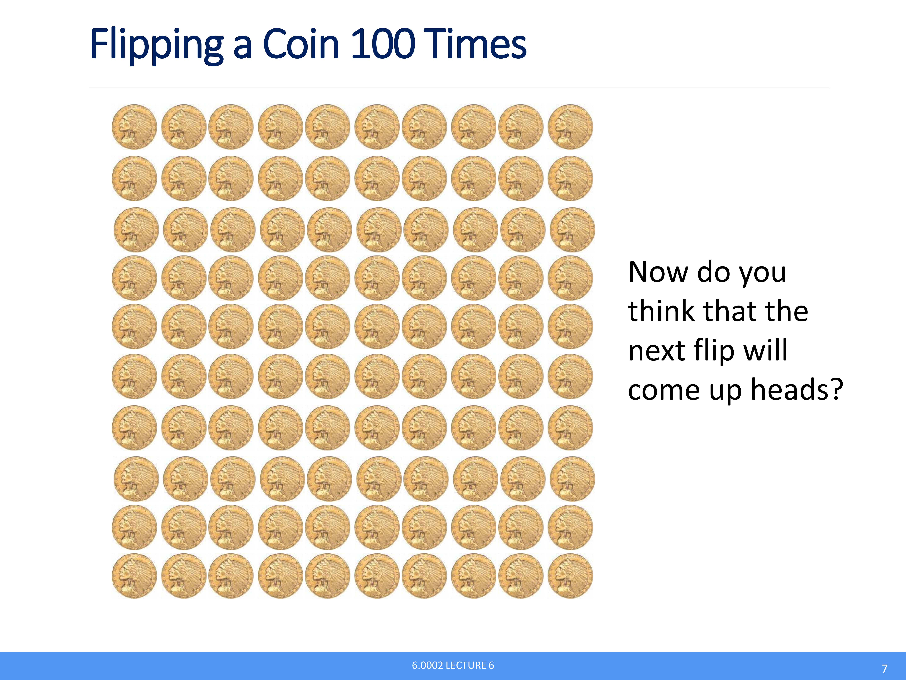
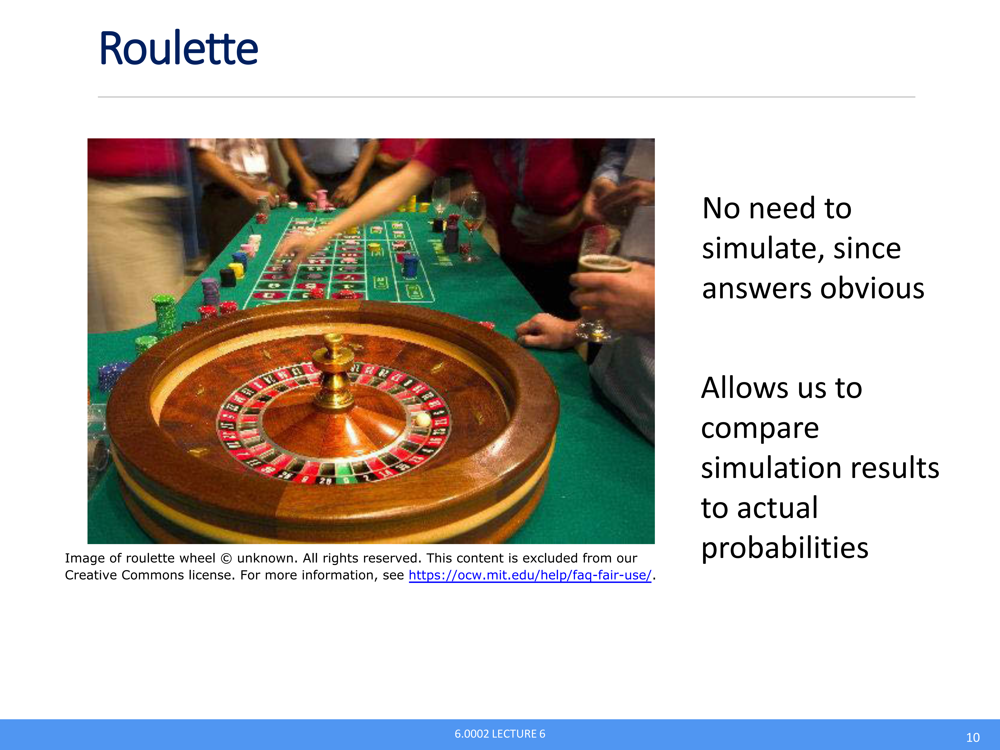
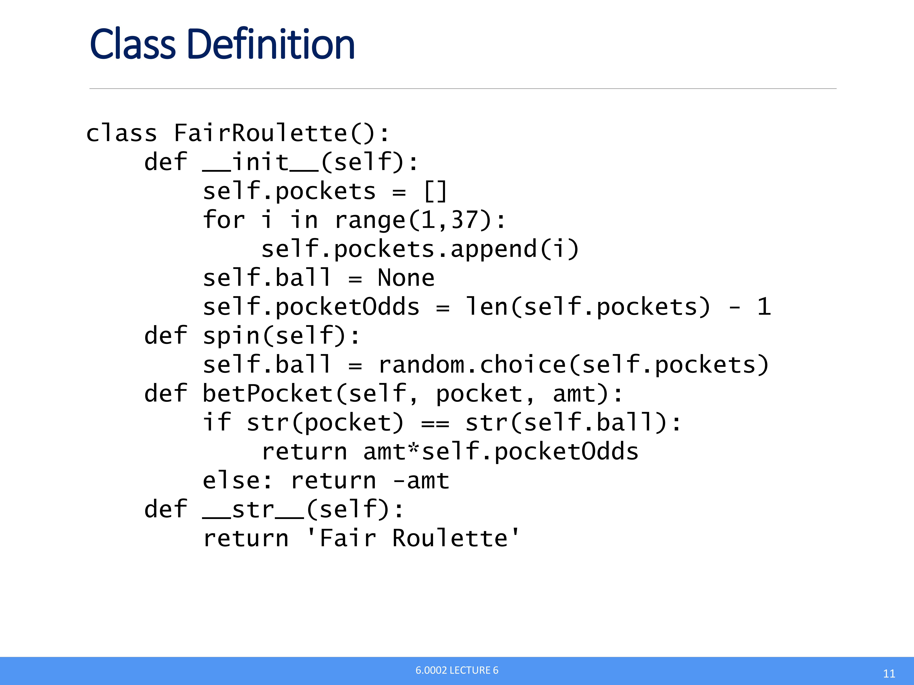
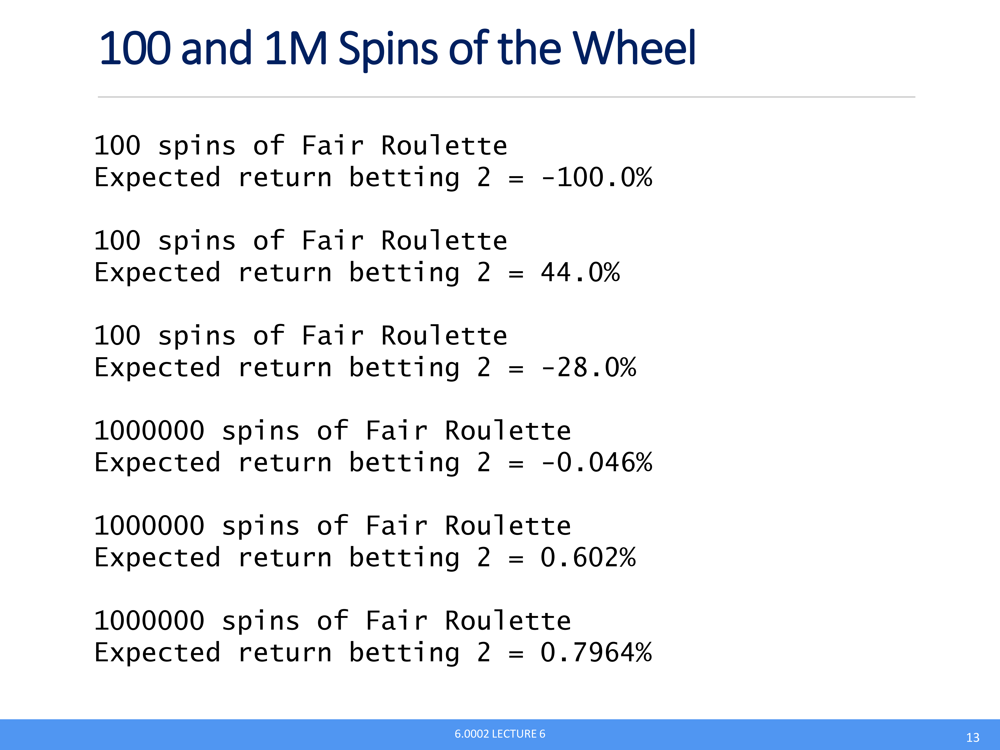
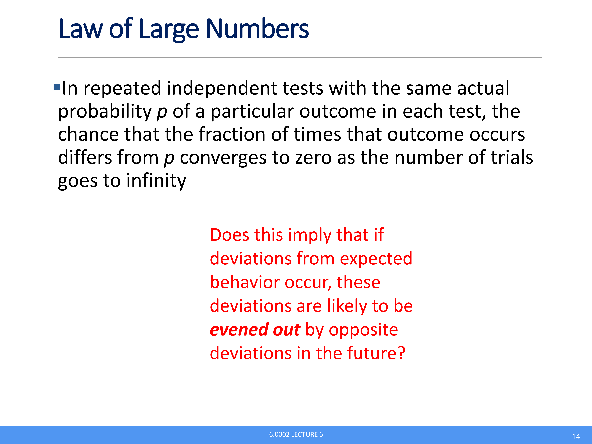

<div align="center">
<h2 align="center">
  
</h2>
<h2 align="center">
  <b>SlideRAG: PPT-Centric Multimodal RAG for Study Preview & Exam Review</b>
</h2>
<div>
<a href="./README.md"><b>English</b></a> | <a href="./README_zh.md">简体中文</a>
</div>
<br/>
<div align="center">
    
    
    
    
</div>
</div>

## :new: Updates
- [04/2026] :fire: SlideRAG is now open-source.

## :rocket: SlideRAG
🎓 SlideRAG is an end-to-end assistant for understanding PPT/PPTX files as multimodal learning materials.

🧠 Unlike text-only QA systems, SlideRAG treats each slide as a structured multimodal unit and combines parsing, retrieval, and agent tool-calling.

📌 It is designed for two key learning scenarios: before-class preview and before-exam review.

## 🎬 Demo Showcase

Below are snapshots from example.pdf demonstrating SlideRAG's capabilities across various slide types and content structures:

<table>
<tr>
<td></td>
<td></td>
<td></td>
<td></td>
</tr>
<tr>
<td></td>
<td></td>
<td></td>
<td></td>
</tr>
<tr>
<td></td>
<td></td>
<td></td>
<td></td>
</tr>
</table>

QA case snapshots:

<table>
<tr>
<td></td>
<td></td>
<td></td>
<td></td>
</tr>
</table>

## :sparkles: Key Features
- 🖼️ **PPT-first multimodal RAG pipeline**: Uses a unified multimodal parser and a graph-and-vector hybrid retrieval engine to support grounded QA across text, images, tables, and equations.
- 🪄 **Hidden-information expansion for concise slides**: Detects high-compression pages and expands implicit content into grounded explanatory text.
- 🔗 **Page-topic extraction and structural linking**: Extracts per-page topics and links related slides to model section-level continuity in long decks.
- 🤝 **Easy to use**: One backend supports Web, QQ, and WeChat, making the assistant accessible in familiar study workflows.

## 🧩 Framework


SlideRAG follows a retrieval-augmented agent workflow:
1. Parse PPT/PPTX into typed multimodal items with page metadata.
2. Perform PPT-oriented enhancement (hidden-info expansion + topic extraction/linking).
3. Build unified multimodal knowledge storage for hybrid retrieval.
4. Use tool-calling agent loop to retrieve evidence and trigger optional image understanding.
5. Return grounded answers through Web/QQ/WeChat channels.

## 🚀 Quick Start

This section helps you run SlideRAG quickly for web usage, then optionally connect it to QQ or WeChat.

### 1. Clone and install
```bash
git clone https://github.com/Hitlh/SlideRAG.git
cd SlideRAG

# Core dependencies
pip install -e .

# Optional channel dependencies
pip install -e .[qq]
pip install -e .[weixin]
pip install -e .[channels]
```

Because this project focuses on PPT understanding, install LibreOffice as an extra system dependency:
- Ubuntu/Debian: `sudo apt-get install libreoffice`
- Windows: download installer from the official website: https://www.libreoffice.org/
- macOS: `brew install --cask libreoffice`

### 2. Configure environment variables

Create a `.env` file by copying content from `env.project.example`, then fill in your keys and model settings.

> Note: If you want to tune advanced parser/context behavior (for example, `SUMMARY_LANGUAGE`, hidden-expansion options, and context window settings), edit the **Advanced parser/context options (optional)** section in `env.project.example`.

#### 2.1 API keys and base models
```env
OPENAI_API_KEY=your_openai_api_key
OPENAI_BASE_URL=your_base_url

# Text and vision models used by SlideRAG pipeline
TEXT_LLM_MODEL=gpt-5.4
VLM_MODEL=gpt-5.4
```

#### 2.2 Agent model provider
```env
# Agent provider for rag_agent loop: openai | anthropic
AGENT_PROVIDER=openai
AGENT_MODEL=gpt-5.4

# Anthropic provider settings (only required when AGENT_PROVIDER=anthropic)
# If empty, runtime may fall back to OPENAI_API_KEY / OPENAI_BASE_URL.
ANTHROPIC_API_KEY=
ANTHROPIC_BASE_URL=
```

### 3. Start the web app
```bash
streamlit run client/app.py
```

After startup, open the Streamlit URL shown in terminal and start asking questions about your PPT files.

## Chat App Integration

SlideRAG can run the same QA agent through QQ and WeChat.

### QQ setup (requires QQ extras)

1. Create a QQ bot.
2. Go to the QQ Open Platform (https://q.qq.com/#/), sign in, and create your bot.
3. In your bot console, open "开发控制" and copy `APPID` and `APPSecret`.
4. Go to "沙箱配置", then in "在消息列表配置" choose "添加成员", enter your QQ number, and scan the QR code.
5. Put the files you want to chat with in a folder (default: `./uploaded_docs`).
6. Configure QQ environment variables:

```env
QQ_ENABLED=false                    # Set to true to enable QQ integration
QQ_APP_ID=                          # QQ bot APPID from the Open Platform
QQ_SECRET=                          # QQ bot APPSecret from the Open Platform
QQ_ALLOW_FROM=*                     # Allowed senders; use * to accept all
QQ_TARGET_FILE=                     # Default file to chat with; can switch via /file <filename>
QQ_UPLOADED_DOCS_DIR=./uploaded_docs # Directory that stores your source files

# Startup ready notification
QQ_STARTUP_NOTIFY_ENABLED=true      # Send a startup message when agent is ready
QQ_STARTUP_NOTIFY_MESSAGE=rag agent is ready. # Startup message content
QQ_STARTUP_NOTIFY_CHAT_ID=          # Target chat/user ID for startup notification
```

7. Run QQ backend:

```bash
python3 client/qq_runtime.py
# or
sliderag-qq
```

8. Start chatting. You can switch the active document with: `/file <filename>`.

### WeChat setup (requires WeChat extras)

1. Put the files you want to chat with in a folder (default: `./uploaded_docs`).
2. Configure WeChat environment variables:

```env
WEIXIN_ENABLED=true                # Set to true to enable WeChat integration
WEIXIN_ALLOW_FROM=*                # Allowed senders; use * to accept all
WEIXIN_TARGET_FILE=                # Default file to chat with; can switch via /file <filename>
WEIXIN_UPLOADED_DOCS_DIR=./uploaded_docs # Directory that stores your source files
WEIXIN_STARTUP_NOTIFY_ENABLED=true # Send a startup message when agent is ready
WEIXIN_STARTUP_NOTIFY_MESSAGE=agent is ready. # Startup message content
WEIXIN_STARTUP_NOTIFY_CHAT_ID=     # Target chat/user ID for startup notification
```

3. Run WeChat backend:

```bash
python3 client/weixin_runtime.py
# use -r to force re-login
python3 client/weixin_runtime.py -r
```

4. Scan QR code on first login.
5. Start chatting. You can switch the active document with: `/file <filename>`.

### How to set `ALLOW_FROM` and `STARTUP_NOTIFY_CHAT_ID`

After you send one message in QQ/WeChat, check runtime logs for a line like:

```text
Inbound message: chat_id=..., sender_id=...
```

Use the `sender_id` value for your allowlist and startup notification target.

## 🔗 Related Projects
| Project | Description | Link |
|---|---|---|
| **RAG-Anything** | All-in-One RAG Framework | [GitHub](https://github.com/HKUDS/RAG-Anything.git) |
| **nanobot** | Ultra-Lightweight Personal AI Assistant | [GitHub](https://github.com/HKUDS/nanobot.git) |

## :hugs: Citation
If you find this project useful, please cite:

```bibtex
@software{sliderag2026,
  title={SlideRAG: PPT-Centric Multimodal RAG for Study Preview and Exam Review},
  author={He Liu,Jiahao Zhang},
  year={2026},
  url={https://github.com/Hitlh/SlideRAG}
}
```