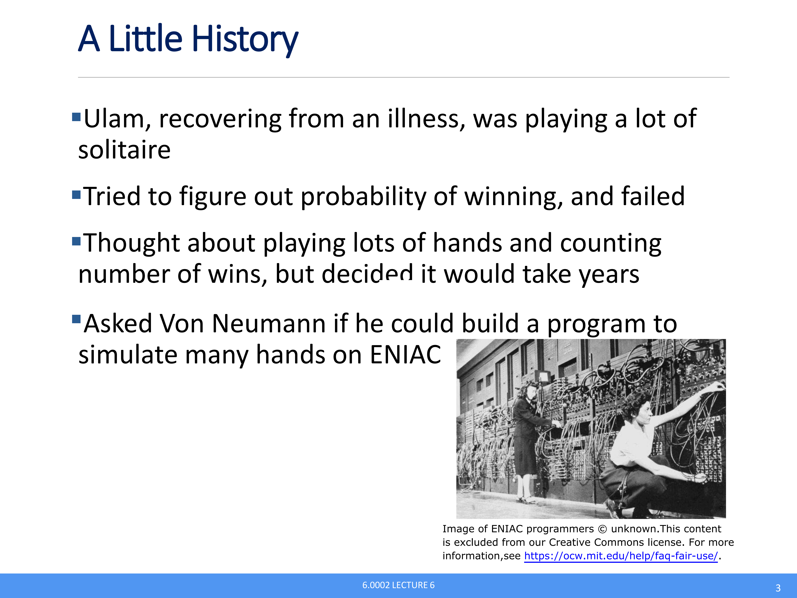
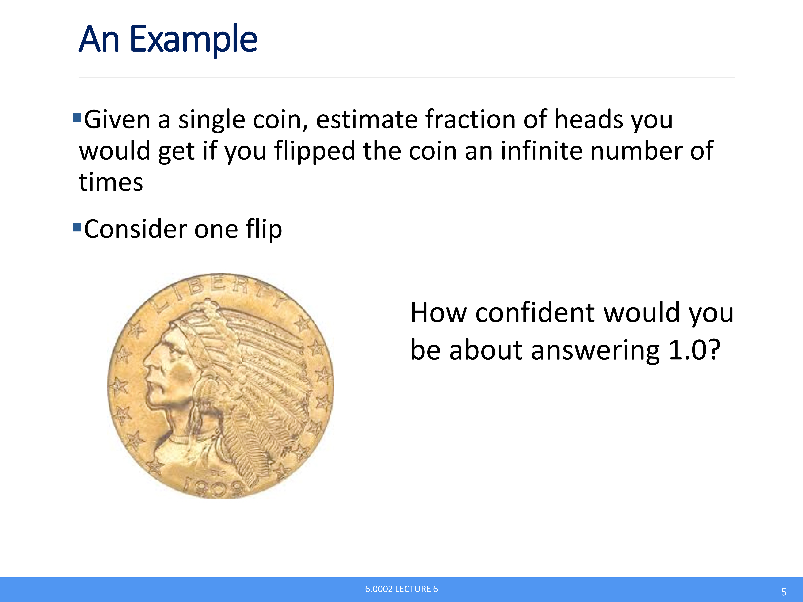
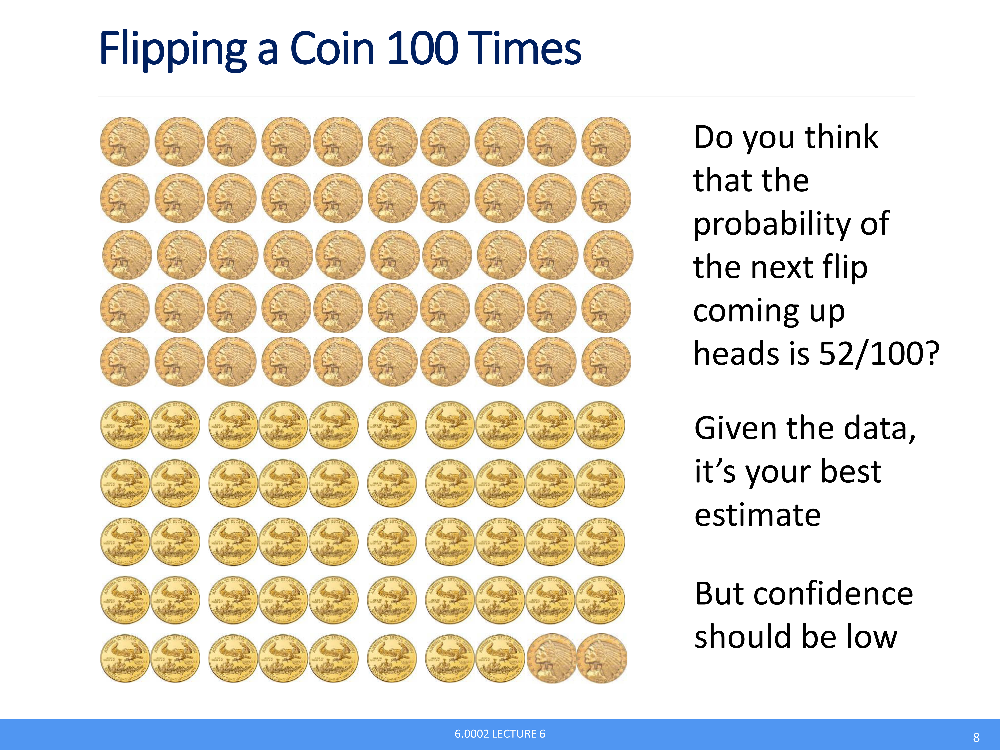
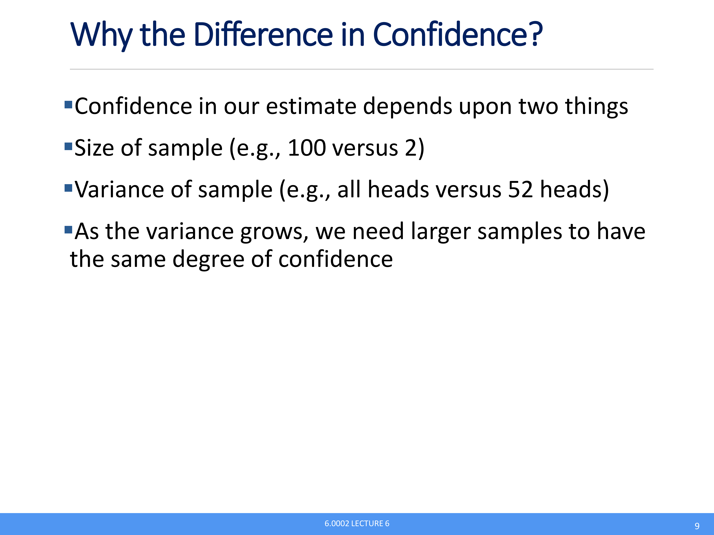
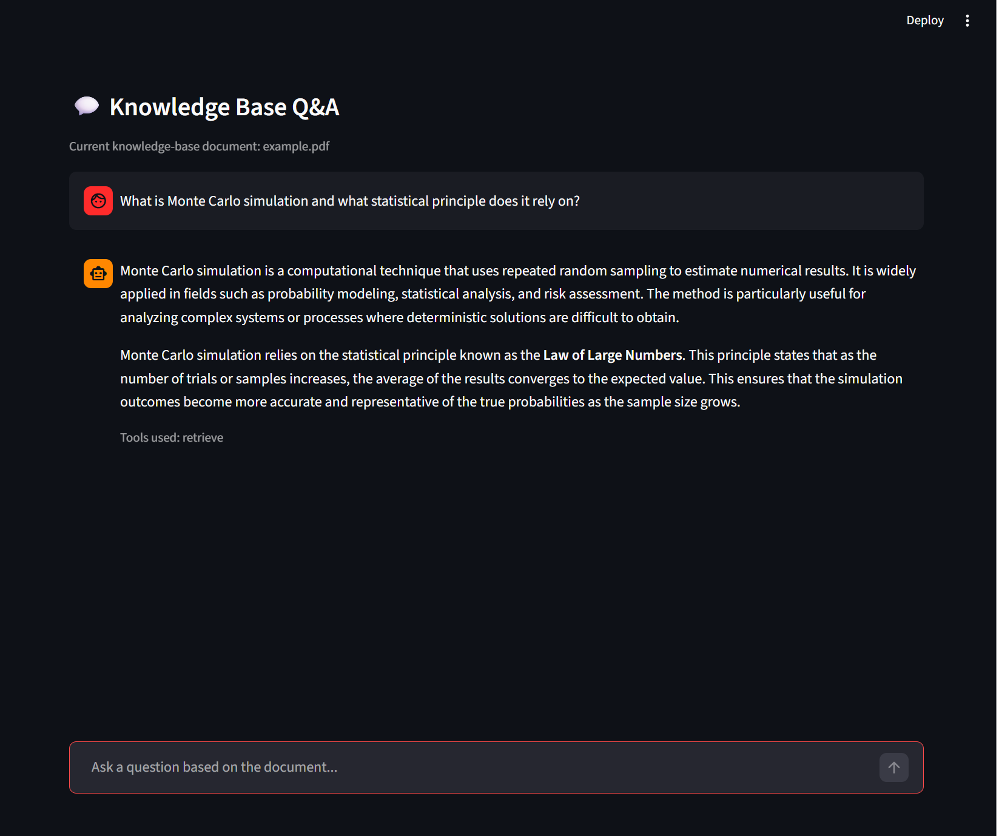
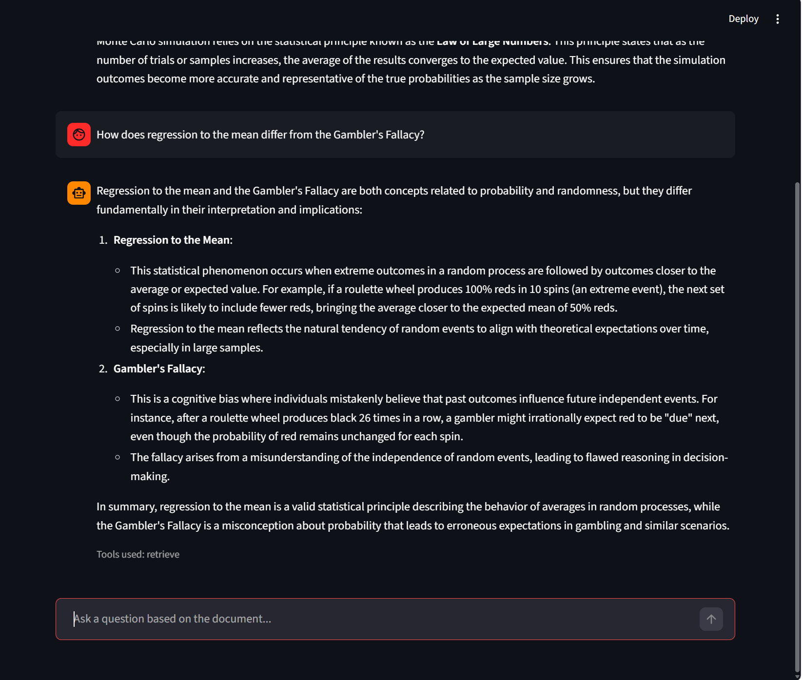
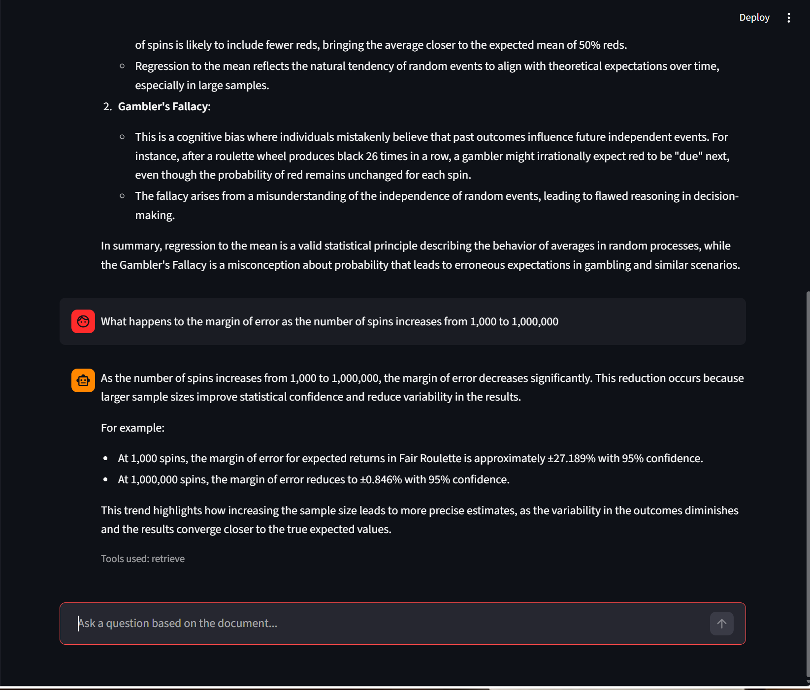
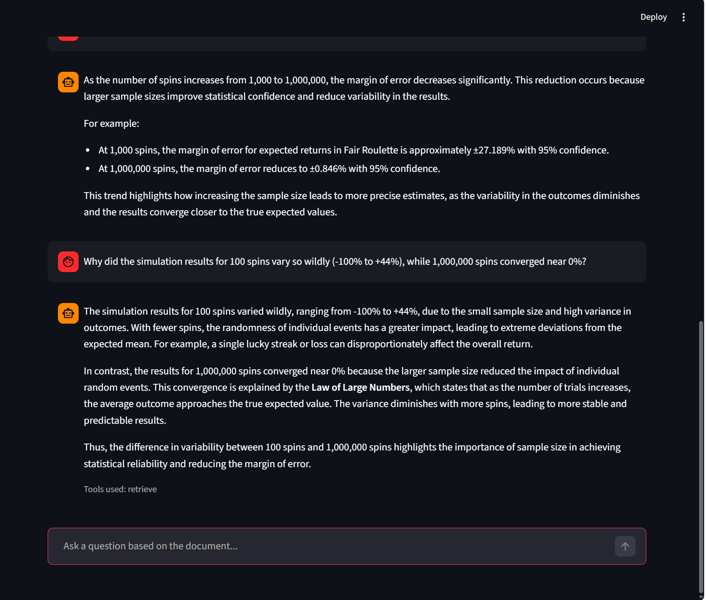
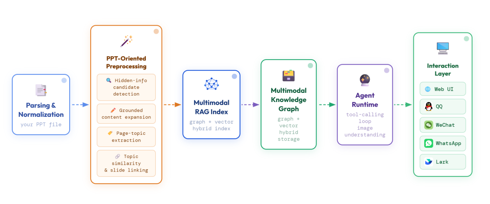
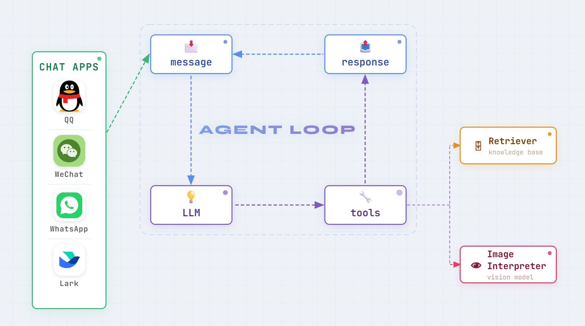

<div align="center">
<h2 align="center">
  
</h2>
<h2 align="center">
  <b>SlideRAG：面向课前预习与考前复习的 PPT 多模态 RAG 系统</b>
</h2>
<div>
<a href="./README.md">English</a> | <a href="./README_zh.md"><b>简体中文</b></a>
</div>
<br/>
<div align="center">
    
    
    
    
</div>
</div>

## :new: Updates
- [04/2026] :fire: SlideRAG 已开源。
- [04/2026] :sparkles: 新增飞书与 WhatsApp 渠道接入，让同一套 SlideRAG Agent 可运行在更多聊天平台。

## :rocket: SlideRAG
🎓 SlideRAG 是一个面向演示文稿（PPT/PPTX）理解场景的端到端智能助手。

🧠 与纯文本文档问答系统不同，SlideRAG 将每一页幻灯片视为结构化多模态单元，并结合解析、检索与 Agent 工具调用。

📌 项目聚焦两个学习场景：课前预习与考前复习。

## 🎬 演示视频

这段视频以产品化视角展示了 SlideRAG 的核心能力，并完整演示了用户侧使用流程：从上传课件、查看解析结果，到围绕 PPT 内容进行多轮问答。

https://github.com/user-attachments/assets/09f12095-fb4e-4cf7-8bc1-ea148d23add9

以下是一个例子，展示了 SlideRAG 在多模态幻灯片内容和结构理解方面的功能表现：

<table>
<tr>
<td></td>
<td></td>
<td></td>
</tr>
<tr>
<td></td>
<td></td>
<td></td>
</tr>
</table>

问答案例截图：

<table>
<tr>
<td></td>
<td></td>
<td></td>
<td></td>
</tr>
</table>

## :sparkles: Key Features
- 🖼️ **PPT 优先的多模态 RAG 管线**：使用统一多模态解析器与图检索 + 向量检索混合引擎，支持基于文本、图像、表格、公式的可溯源问答。
- 🪄 **面向“高压缩表达”页面的隐式信息扩展**：识别信息密度高、文字简略的页面，并补全为有依据的解释性内容。
- 🔗 **页面主题抽取与结构关联**：抽取页级主题并链接相关页面，建模长课件中的章节连续性。
- 🤝 **易于使用**：同一后端支持 Web、QQ、飞书、微信、WhatsApp（Bridge 模式），便于在熟悉的学习场景中直接使用。

## 🧩 Framework



SlideRAG 采用检索增强的 Agent 工作流：
1. 将 PPT/PPTX 解析为带页级元数据的多模态类型化内容。
2. 执行面向 PPT 的增强处理（隐式信息扩展 + 主题抽取与关联）。
3. 构建统一多模态知识存储以支持混合检索。
4. 通过工具调用循环检索证据，并按需触发二阶段图像理解。
5. 通过 Web/QQ/飞书/微信/WhatsApp 通道返回有依据的回答。

## 🚀 快速开始

本节帮助你先快速启动 Web 版本，再按需接入 QQ、飞书、微信或 WhatsApp。

### 1. 克隆并安装
```bash
git clone https://github.com/Hitlh/SlideRAG.git
cd SlideRAG

# 核心依赖
pip install -e .

# 可选渠道依赖
pip install -e .[qq]
pip install -e .[feishu]
pip install -e .[weixin]
pip install -e .[whatsapp]
pip install -e .[channels]
```

由于项目聚焦 PPT 理解，还需要安装 LibreOffice 作为系统依赖：
- Ubuntu/Debian：`sudo apt-get install libreoffice`
- Windows：从官网下载安装包：https://www.libreoffice.org/
- macOS：`brew install --cask libreoffice`

### 2. 配置环境变量

将 `env.project.example` 的内容复制为 `.env` 文件，并填入你的密钥与模型配置。

> 说明：如果你希望调整更高级的解析/上下文行为（例如 `SUMMARY_LANGUAGE`、隐式扩展选项、上下文窗口等），请编辑 `env.project.example` 中的 **Advanced parser/context options (optional)** 小节。

> 国内用户提示：MinerU 默认使用 Hugging Face。若访问不稳定，可在运行前切换到 ModelScope：
>
> ```bash
> export MINERU_MODEL_SOURCE=modelscope
> ```

#### 2.1 API Key 与基础模型
```env
OPENAI_API_KEY=your_openai_api_key
OPENAI_BASE_URL=your_base_url

# SlideRAG 管线使用的文本与视觉模型
TEXT_LLM_MODEL=gpt-5.4
VLM_MODEL=gpt-5.4
```

#### 2.2 Agent 模型提供方
```env
# rag_agent 循环的提供方: openai | anthropic
AGENT_PROVIDER=openai
AGENT_MODEL=gpt-5.4

# Anthropic 提供方配置（仅在 AGENT_PROVIDER=anthropic 时需要）
# 若留空，运行时可能回退到 OPENAI_API_KEY / OPENAI_BASE_URL。
ANTHROPIC_API_KEY=
ANTHROPIC_BASE_URL=
```

### 3. 启动 Web 应用
```bash
streamlit run client/app.py
```

启动后，打开终端输出的 Streamlit 地址，即可围绕 PPT 文件开始提问。

## Chat App Integration

SlideRAG 支持将同一问答 Agent 接入 QQ、飞书、微信与 WhatsApp（Bridge 模式）。

### QQ setup（需安装 QQ 扩展依赖）

1. 创建一个 QQ 机器人。
2. 进入 QQ 开放平台（https://q.qq.com/#/），登录并创建机器人。
3. 在机器人控制台进入“开发控制”，复制 `APPID` 和 `APPSecret`。
4. 进入“沙箱配置”，在“在消息列表配置”中选择“添加成员”，填写你的 QQ 号并扫码。
5. 将要对话的文件放到目录中（默认：`./uploaded_docs`）。
6. 配置 QQ 环境变量：

```env
QQ_ENABLED=false                    # 设为 true 启用 QQ 集成
QQ_APP_ID=                          # QQ 开放平台的 APPID
QQ_SECRET=                          # QQ 开放平台的 APPSecret
QQ_ALLOW_FROM=*                     # 允许的发送者，* 表示全部允许
QQ_TARGET_FILE=                     # 默认对话文件，可通过 /file <filename> 切换
QQ_UPLOADED_DOCS_DIR=./uploaded_docs # 源文件存放目录

# 启动就绪通知
QQ_STARTUP_NOTIFY_ENABLED=true      # Agent 就绪后发送启动通知
QQ_STARTUP_NOTIFY_MESSAGE=rag agent is ready. # 启动通知文案
QQ_STARTUP_NOTIFY_CHAT_ID=          # 启动通知目标会话/用户 ID
```

7. 启动 QQ 后端：

```bash
python3 -m client.qq.runtime
# 或
sliderag-qq
```

8. 开始聊天。可通过 `/file <filename>` 切换当前文档。

### 飞书配置（需安装飞书扩展依赖）

1. 进入飞书开放平台。中国区可使用 open.feishu.cn，海外区可使用 open.larksuite.com。
2. 创建一个应用，并添加“机器人”能力。
3. 在开发配置 > 权限管理中，开通消息相关权限：
  - im:message
  - im:message.p2p_msg:readonly
4. 在开发配置 > 事件与回调中使用长连接接收事件，然后添加事件：
  - im.message.receive_v1
5. 在“凭证与基础信息”中保存 App ID 和 App Secret。
6. 发布你的应用。
7. 将要对话的文件放到目录中（默认：`./uploaded_docs`）。
8. 配置飞书环境变量：

```env
FEISHU_ENABLED=true
FEISHU_APP_ID=
FEISHU_APP_SECRET=
FEISHU_ENCRYPT_KEY=
FEISHU_VERIFICATION_TOKEN=
FEISHU_ALLOW_FROM=*
# feishu（中国）| lark（海外）
FEISHU_DOMAIN=feishu

# 可选：启动时自动 ingest 的目标文件
FEISHU_TARGET_FILE=

# 运行目录
FEISHU_UPLOADED_DOCS_DIR=./uploaded_docs
FEISHU_INGEST_OUTPUT_DIR=./output
FEISHU_RAG_WORKING_DIR=./rag_storage_by_feishu_file
FEISHU_RUNTIME_STATE_DIR=./rag_storage_feishu_runtime

# 启动就绪通知
FEISHU_STARTUP_NOTIFY_ENABLED=true
FEISHU_STARTUP_NOTIFY_MESSAGE=agent is ready.
FEISHU_STARTUP_NOTIFY_CHAT_ID=
```

9. 启动飞书后端：

```bash
python3 -m client.feishu.runtime
```

10. 如果你要使用 `FEISHU_ALLOW_FROM` 或 `FEISHU_STARTUP_NOTIFY_CHAT_ID`，先在飞书里发一条消息，再到运行日志里查看 `sender_id`。

### WeChat setup（需安装微信扩展依赖）

1. 将要对话的文件放到目录中（默认：`./uploaded_docs`）。
2. 配置微信环境变量：

```env
WEIXIN_ENABLED=true                # 设为 true 启用微信集成
WEIXIN_ALLOW_FROM=*                # 允许的发送者，* 表示全部允许
WEIXIN_TARGET_FILE=                # 默认对话文件，可通过 /file <filename> 切换
WEIXIN_UPLOADED_DOCS_DIR=./uploaded_docs # 源文件存放目录
WEIXIN_STARTUP_NOTIFY_ENABLED=true # Agent 就绪后发送启动通知
WEIXIN_STARTUP_NOTIFY_MESSAGE=agent is ready. # 启动通知文案
WEIXIN_STARTUP_NOTIFY_CHAT_ID=     # 启动通知目标会话/用户 ID
```

3. 启动微信后端：

```bash
python3 -m client.weixin.runtime
# 使用 -r 可强制重新登录
python3 -m client.weixin.runtime -r
```

4. 首次登录时扫码。
5. 开始聊天。可通过 `/file <filename>` 切换当前文档。

### WhatsApp setup（需安装 WhatsApp 扩展依赖 + 本地 Bridge）

SlideRAG 的 WhatsApp 通道采用本地 WebSocket Bridge（协议消息：`message/status/qr/error`，`send/send_media`）。

1. 启动本仓库自带的本地 WhatsApp Bridge（默认地址 `ws://127.0.0.1:3001`），并保持进程常驻。
Bridge 启动示例：

```bash
cd /path/to/SlideRAG/bridge
npm install
npm run build

export BRIDGE_PORT=3001
export BRIDGE_TOKEN=replace_with_secret
export AUTH_DIR=/abs/path/to/wa_auth
npm start
```

其中 `BRIDGE_TOKEN` 必须与 SlideRAG `.env` 中的 `WHATSAPP_BRIDGE_TOKEN` 保持一致。
> 温馨提示：如果你是用同一个 WhatsApp 账号给自己发消息做测试，
> 启动 bridge 前请设置 `export WHATSAPP_ACCEPT_FROM_ME=true`。
2. 配置 WhatsApp 环境变量：

```env
WHATSAPP_ENABLED=true
WHATSAPP_ALLOW_FROM=*                      # 允许的 sender/chat id，* 表示全部允许
WHATSAPP_BRIDGE_URL=ws://127.0.0.1:3001    # 本地 Bridge 地址
WHATSAPP_BRIDGE_TOKEN=replace_with_secret  # 必须与 Bridge 的 BRIDGE_TOKEN 一致
WHATSAPP_RECONNECT_DELAY_S=5
WHATSAPP_SEND_RETRY_ATTEMPTS=3             # 出站发送失败重试次数
WHATSAPP_SEND_RETRY_DELAY_MS=400           # 出站重试间隔（毫秒）
WHATSAPP_ACCEPT_GROUP_MESSAGES=true        # 是否接收群消息
WHATSAPP_REQUIRE_MENTION_IN_GROUP=true     # 群聊中是否仅在被 @ 时回复
WHATSAPP_TARGET_FILE=                      # 可选；默认文档，可通过 /file <filename> 切换
WHATSAPP_UPLOADED_DOCS_DIR=./uploaded_docs
WHATSAPP_INGEST_OUTPUT_DIR=./output
WHATSAPP_RAG_WORKING_DIR=./rag_storage_by_whatsapp_file
WHATSAPP_RUNTIME_STATE_DIR=./rag_storage_whatsapp_runtime
WHATSAPP_STARTUP_NOTIFY_ENABLED=true
WHATSAPP_STARTUP_NOTIFY_MESSAGE=agent is ready.
WHATSAPP_STARTUP_NOTIFY_CHAT_ID=
```

3. 启动 WhatsApp 后端：

```bash
python3 client/whatsapp/runtime.py
# 或
sliderag-whatsapp
```

4. 开始聊天。支持：
- 普通问答消息
- `/file <filename>` 切换当前文档
- `/status` 查看运行状态（bridge/whatsapp 连接、队列长度、当前模型与文档）

### 如何设置 `ALLOW_FROM` 与 `STARTUP_NOTIFY_CHAT_ID`

在 QQ/微信/WhatsApp 先发送一条消息，然后查看运行日志中类似下面的内容：

```text
Inbound message: chat_id=..., sender_id=...
```

将其中的 `sender_id` 用于白名单和启动通知目标。

## 🔗 相关项目
| 项目 | 说明 | 链接 |
|---|---|---|
| **RAG-Anything** | RAG-Anything: All-in-One RAG Framework | [GitHub](https://github.com/HKUDS/RAG-Anything.git) |
| **nanobot** | nanobot: The Ultra-Lightweight Personal AI Assistant | [GitHub](https://github.com/HKUDS/nanobot.git) |

## :hugs: Citation
如果你觉得本项目对你有帮助，欢迎引用：

```bibtex
@software{sliderag2026,
  title={SlideRAG: PPT-Centric Multimodal RAG for Study Preview and Exam Review},
  author={He Liu,Jiahao Zhang},
  year={2026},
  url={https://github.com/Hitlh/SlideRAG}
}
```
